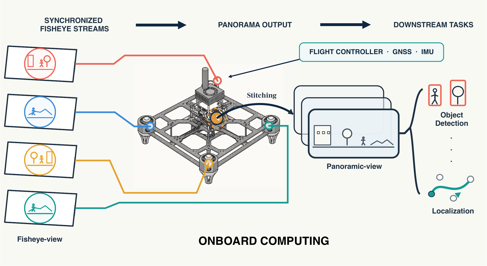

> Hardware: [Open the sanitized panoramic-UAV reference CAD assembly](hardware/) (AP242 STEP, checksum, license boundary, and safety notice). This is a research reference, not a certified or ready-to-fly design.

> Dataset: [Download the released panorama and fisheye data from Dropbox](https://www.dropbox.com/scl/fo/idhp8w5r5s1du2wjt3qjb/AJuZcWHVsMKjzFzAc8-zLTM?rlkey=jh7k1wcxgji3w8qw0rr0vqev4&st=bz72qlfl&dl=0)


# Parallax-Aware UAV Panorama Stitcher


Official code release for:

> From Multi-Fisheye Sensing to Panoramic Perception: A Parallax-Aware Onboard Platform for Ultra-Low-Altitude UAVs

This repository provides the single-file `quality_full` panorama stitcher used for the paper's 1280x640 ERP pipeline. It converts four synchronized fisheye images into an equirectangular panorama using per-overlap projection-depth selection, temporal hysteresis, CUDA projection, dynamic seams, photometric correction, and two-band fusion.

<p align="center">
  
</p>


The raw flight data are distributed separately. See [`DATASET.md`](DATASET.md) for the Dropbox download link and checksum instructions.

## Scope

- Four synchronized fisheye inputs
- 1280x640 ERP output with a 2:1 contract
- Per-seam adaptive projection from the five-layer depth bank
- Fast-margin temporal state updates
- CUDA execution on Jetson Orin NX, with a CPU-compatible reference path for functional checks
- No YOLO/VPR downstream code or model weights in this repository

## Installation

Install a Python environment with a JetPack-matched PyTorch build on Jetson:

```bash
python3 -m pip install -r requirements.txt
```

Do not replace the CUDA-enabled PyTorch supplied for the target Jetson image.

## Run

The default calibration and color/refinement files are in this repository. Supply a directory containing the four synchronized camera folders:

```bash
python3 stitch_parallax_aware.py \
  --input-dir /path/to/four_fisheye_sequence \
  --calib-dir calibration \
  --refinement-path configs/image_alignment_refinement.json \
  --color-calibration-path configs/color_balance_calibration.json \
  --output-dir outputs/panoramas \
  --device auto \
  --max-frames 20
```

Use `--no-refinement` only when the supplied calibration has not been paired with the released refinement file. Use `--device cuda` for the Jetson deployment path and `--device torch-cpu` for a functional compatibility check.

## Input convention

The default logical mapping is:

```text
left   -> left_front
bleft  -> right_front
right  -> right_back
bright -> left_back
```

The input directory should contain `fisheye_<topic>_image_raw` or `fisheye_<topic>_image_raw_compress_compressed` folders. Image filenames must end in a parseable timestamp.

## Reproducibility

The paper's complete Jetson protocol, including strict 20 Hz pacing, timing gates, power logging, and repeated runs, is summarized in [`docs/reproducibility.md`](docs/reproducibility.md). The reported runtime numbers require the specified Jetson Orin NX hardware and environment; desktop timings are not substitutes.

## Citation

If you use this code, cite the paper listed in [`CITATION.cff`](CITATION.cff). The manuscript DOI will be added after publication.

## License

The code is released under the MIT License. Calibration files are provided for the released camera rig and should not be assumed to transfer to another physical rig without recalibration.
